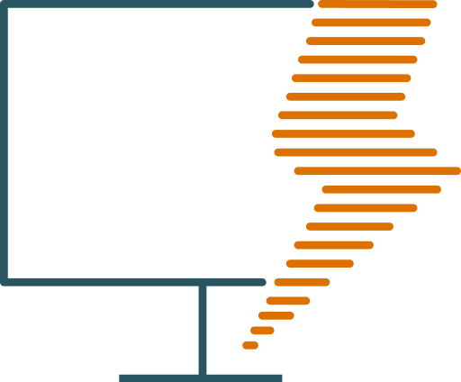

## Features

- On demand Cloud Workstations.
- Ability to create and build custom image templates.
- Ability to install custom dependencies.
- In browser RDP client support.

## Installation
<!-- TOC -->
 - [Local Setup](#local)
- [Docker Setup ](#docker)
 
<!-- /TOC -->

# Local

To setup the repository locally follow the steps mentioned below:

1. Install bench and set up a `frappe-bench` directory by following the [installation steps](https://frappeframework.com/docs/user/en/installation).

1. Move into your `frappe-bench` directory and get the FlashDesk app
   ```sh
   bench get-app https://github.com/arunmathaisk/flashdesk
   ```
1. Create a new site

   ```sh
   bench new-site flashdesk.site
   ```

1. Map your site to localhost

   ```sh
   bench --site flashdesk.site add-to-hosts
   ```

1. Install the app onto your site

   ```sh
   bench --site flashdesk.site install-app flashdesk
   ```

1. Start the bench server

   ```sh
   bench start
   ```

1. Start the frontend development server

   ```sh
   cd apps/flashdesk && yarn dev
   ```

1. Finally, open the URL http://flashdesk.site:8000/frontend in your browser to see the app running.

# Docker

This guide provides step-by-step instructions to install the project using Docker via VSCode Remote Containers extension. 

## Prerequisites

Before you begin, make sure you have the following prerequisites installed on your system:

1. [Docker](https://docs.docker.com/get-docker/)
2. [Docker Compose](https://docs.docker.com/compose/install/)
3. User added to docker group
    ```shell
    sudo usermod -aG docker $USER
    ```
4. [VSCode Remote - Containers extension](https://marketplace.visualstudio.com/items?itemName=ms-vscode-remote.remote-containers)

### Step 1: Cloning frappe_docker repo

```shell
git clone https://github.com/frappe/frappe_docker.git
cd frappe_docker
```

### Step 2: Copy example devcontainer config from devcontainer-example to .devcontainer

Note: 

Feel free to expore the files within devcontainer-example and make changes to the same, be that exposing DB ports or mount desired additonal volumes. 

```shell
cp -R devcontainer-example .devcontainer
```

### Step 3: Copy example vscode config for devcontainer from development/vscode-example to development/.vscode.

This will setup basic configuration for debugging.

```shell
cp -R development/vscode-example development/.vscode
```

### Step 4: Open frappe_docker folder in VS Code(After the extensions are installed).

```shell
code .
```
Note:

The development directory is ignored by git.
It is mounted and available inside the container. Create all your benches (installations of bench, the tool that manages frappe) inside this directory.

### Step 5: Setup Bench

Run the following commands in the terminal inside the container. You might need to create a new terminal in VSCode.

```shell
# Use default environments
bench init --skip-redis-config-generation --frappe-branch version-14 frappe-bench
# Or set environment versions explicitly
nvm use v16
PYENV_VERSION=3.10.5 bench init --skip-redis-config-generation --frappe-branch version-14 frappe-bench

cd frappe-bench

```
### Step 6: Setup hosts

We need to tell bench to use the right containers instead of localhost. Run the following commands inside the container:

```shell
bench set-config -g db_host mariadb
bench set-config -g redis_cache redis://redis-cache:6379
bench set-config -g redis_queue redis://redis-queue:6379
bench set-config -g redis_socketio redis://redis-socketio:6379
```
For any reason the above commands fail, set the values in `common_site_config.json` manually.

```json
{
  "db_host": "mariadb",
  "redis_cache": "redis://redis-cache:6379",
  "redis_queue": "redis://redis-queue:6379",
  "redis_socketio": "redis://redis-socketio:6379"
}
```

### Step 7: Create a new site 

Note: Sitename must end with .localhost for trying deployments locally.

for example:

```shell
bench new-site flashdesk.localhost --no-mariadb-socket
```
The same command can be run non-interactively as well:

```shell
bench new-site flashdesk.localhost --mariadb-root-password 123 --admin-password admin --no-mariadb-socket
```

### Step 8: Set bench in developer mode on the new site

```shell
bench --site flashdesk.localhost set-config developer_mode 1
bench --site flashdesk.localhost clear-cache
```

### Step 9: Set current site 

```shell
bench use flashdesk.localhost
```

### Step 10: Install the FlashDesk app onto the site created 

```shell
bench get-app https://github.com/arunmathaisk/flashdesk

bench --site flashdesk.localhost install-app flashdesk
```
### Step 11: Start Bench

Execute following command from the `frappe-bench` directory.

```shell
bench start
```

### Step 12: Start the frontend development server

You are all set now :)

```shell
cd apps/flashdesk && yarn dev
```

Finally, open the URL http://flashdesk.localhost:8000/frontend in your browser to see the app running.

## Contributions and Community

There are many ways you can contribute even if you don't code:

1. You can start by giving a star to this repository!
1. If you find any issues, even if it is a typo, you can [raise an issue](https://github.com/arunmathaisk/flashdesk/issues/new) to inform us.

If you want to contribute code then you can fork this repo, make changes and raise a PR. ([see how to](https://docs.github.com/en/pull-requests/collaborating-with-pull-requests/proposing-changes-to-your-work-with-pull-requests/creating-a-pull-request-from-a-fork))

## License

[GNU Affero General Public License v3.0](LICENSE)

## Warning
FlashDesk is currently marked as **noob-phase** expect breaking changes between versions.